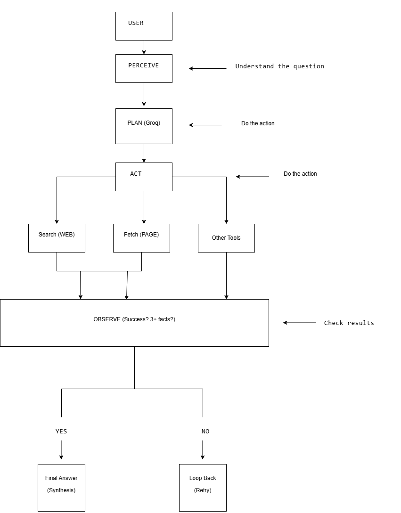

# AI Research Agent - Iterative Web Research (UC2)

## Problem Statement

This project implements an **Iterative Web Research Agent** (Use Case 2) as part of the Agent Loop topic in the AI Development Preparation assignment. Given a research question, the agent autonomously:

1. **Searches the web** for relevant information
2. **Fetches pages** from top results
3. **Judges** if the gathered information is sufficient
4. **Refines the query** or **stops** and produces a cited summary

The agent follows an explicit **Perceive → Plan → Act → Observe** loop with a real LLM (Groq/Llama) driving the planning stage.

---

## Architecture



### Agent Loop Stages

| Stage | Description |
|-------|-------------|
| **Perceive** | Understands the user's research query |
| **Plan** | Calls LLM to decide next action (web_search or fetch_page) |
| **Act** | Executes the chosen tool/function |
| **Observe** | Processes results, updates knowledge, checks success |

### Tools Available
- `web_search` — Searches DuckDuckGo for relevant snippets
- `fetch_page` — Fetches and extracts text from a webpage

### Termination Rules
- **Max iterations**: 5 (hard limit)
- **Success condition**: Gathered 3+ facts OR successfully fetched a full page

---

## Technologies Used

| Component | Technology |
|-----------|------------|
| Language | Python 3.14 |
| LLM | Groq API (llama-3.3-70b-versatile) |
| Web Search | DuckDuckGo (lite + HTML fallback) |
| Web Scraping | BeautifulSoup4 |
| HTTP Requests | requests |
| Environment | python-dotenv |

---

## Setup Instructions

### 1. Clone the Repository
```bash
git clone https://github.com/Sharukash04/AI-DEVELOPMENT.git;
cd agent-loop-research